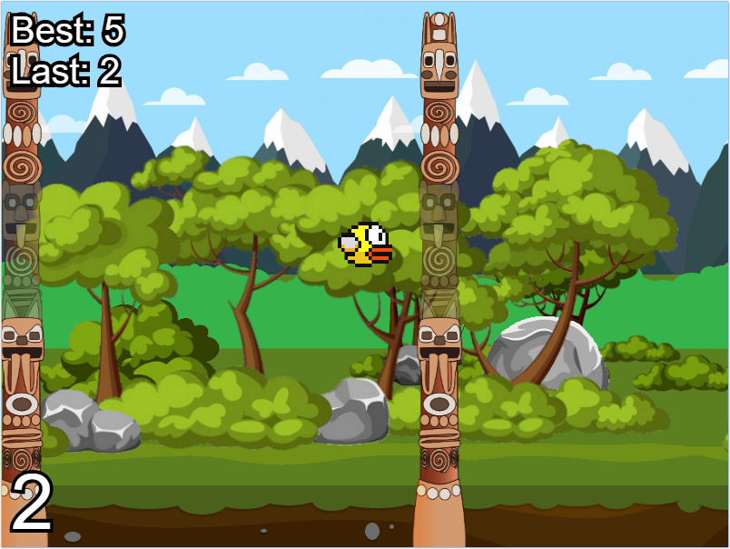

# Pulfrich Bird

3D Flappy Bird using the pulfrich effect. 
Get a pair of dark tinted sunglasses and pop out the left lens, and play away! 
Best in a bright room and far (>70cm) from a monitor with high brightness.

The collision detection is awful so you probably won't die for a while but I'd still be amazed if you had the patience and time to get above 100.
This project is mostly finished, however I plan on fixing the collision and adding some form of leaderboard/stats (eventually).
